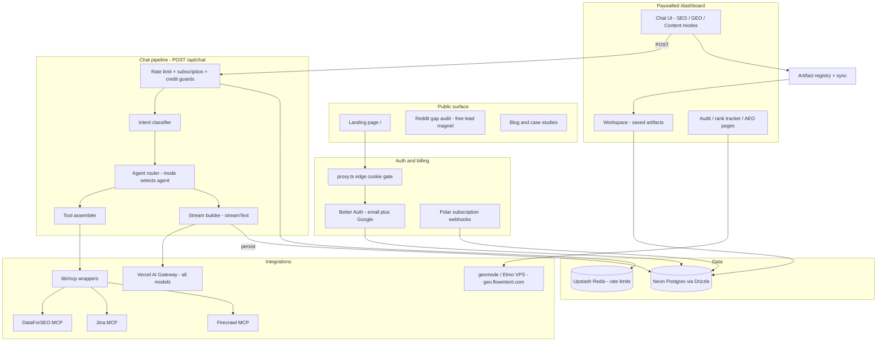

# FLOWINTENT (SEOBOT) — PROJECT KNOWLEDGE BASE

**Updated:** 2026-07-06

AI-powered SEO, GEO / AEO, and content platform (**FlowIntent** brand). Next.js 16 + React 19 + Vercel AI SDK 6 + MCP integrations (DataForSEO, Jina, Firecrawl). Auth via Better Auth, billing via Polar, database on Neon (Drizzle ORM).

## DOCS INDEX

Folder-level guides (each links back here):

| Doc | Covers |
|-----|--------|
| [`app/AGENTS.md`](app/AGENTS.md) | App Router pages + API routes, auth/streaming patterns, protected vs public routes |
| [`lib/AGENTS.md`](lib/AGENTS.md) | Core business logic: agents, chat pipeline, artifacts, GEO, MCP wrappers, billing |
| [`components/AGENTS.md`](components/AGENTS.md) | React UI: shadcn primitives, chat tool-ui, workspace, dashboard shell |
| [`mcps/AGENTS.md`](mcps/AGENTS.md) | Auto-generated MCP bindings — never edit or import directly |

Key product docs: canonical spec [`docs/specs/platform-modes.md`](docs/specs/platform-modes.md) · GEO tracking design [`docs/specs/2026-06-12-geomode-geo-tracking-design.md`](docs/specs/2026-06-12-geomode-geo-tracking-design.md) · chatbot UX findings [`docs/specs/2026-07-06-chatbot-ux-findings.md`](docs/specs/2026-07-06-chatbot-ux-findings.md)

## ARCHITECTURE



Flow in one paragraph: unauthenticated users see the marketing pages and the free `/reddit-gap` audit; `proxy.ts` gates `/dashboard/*` behind a Better Auth session cookie. The dashboard is a mode-aware chat (SEO / GEO / Content). `POST /api/chat` runs guards (rate limit, Polar subscription, credit cap), classifies intent, routes to an agent, assembles MCP-backed tools, and streams the response through the Vercel AI Gateway while persisting conversations to Neon. Tool results matching the artifact registry hydrate the artifacts panel and can be saved to the Workspace.

## STRUCTURE

```
seobot/
├── app/          # Next.js 16 App Router (pages + API routes)
├── components/   # React components (shadcn/ui base)
├── lib/          # Core business logic (agents, chat, geo, mcp, billing)
├── mcps/         # Auto-generated MCP bindings (DO NOT EDIT)
├── drizzle/      # SQL migrations (Neon)
├── docs/         # Specs, guides, reports, research, archives
├── hooks/        # Shared React hooks (use-toast, use-mode-adaptations)
├── types/        # Ambient .d.ts + shared type modules
├── public/       # Static assets, llms.txt
├── scripts/      # Seed scripts, env validation, deploy tooling
├── services/     # geomode-companion VPS service (deployed via scripts/deploy)
└── tests/        # Vitest unit + integration tests
```

## CODE GUIDELINES

### TypeScript
- Strict mode; **never** `as any` or `@ts-ignore`. Type the boundary instead.
- All imports at the top of the module — no inline `import()` in function bodies.
- Exhaustive `switch` over unions/enums: `default` must assign to `never`.
- Validate external input (API bodies, webhooks, env) with `zod`; trust internal code.
- Path alias `@/*` maps to the repo root (`@/lib/agents/registry`).

### Next.js / React
- Server Components by default; add `'use client'` only when state/effects/DOM are needed.
- Route Handlers live in `app/api/`; pages are thin wrappers delegating to `components/`.
- Fonts via `next/font` variables (`--font-sans` Inter, `--font-mono` JetBrains Mono).
- Framer Motion for animation, Recharts for charts; extend `components/ui/` primitives, don't duplicate them.

### API routes
- Every protected route validates the session first: `auth.api.getSession({ headers })` (or `requireApiSubscription()` for paywalled features). Never skip auth checks.
- Paywalled features: `requireApiSubscription()` from `lib/billing/subscription-guard.ts`.
- Rate limit via `lib/redis/rate-limit.ts`; return structured JSON errors `{ error: code, message }` with correct status codes.
- Never leak raw provider/internal error text to clients — map through `lib/errors/`.

### AI / chat
- All models go through `vercelGateway` (`lib/ai/gateway-provider.ts`) — never instantiate provider SDKs directly or hardcode model IDs outside env/config.
- New agents register in `lib/agents/registry.ts` and route via `lib/agents/agent-router.ts`.
- New tools go through `lib/chat/tool-assembler.ts` (which applies timeouts); tool UIs in `components/chat/tool-ui/` must match the tool output schema.
- Artifact types map tool names → panels in `lib/artifacts/registry.ts`.

### Styling
- Tailwind + shadcn/ui tokens from `app/globals.css` (neutral dark, Cursor-style: hairline borders, `rounded-lg`/`rounded-xl`, sentence case).
- Mode accents come from `CHAT_MODE_ACCENT_CLASSES` in `lib/chat/modes.ts` — never hardcode emerald/violet/amber per surface.

### Database
- Schema in `lib/db/schema.ts`; migrations generated into `drizzle/` (`npx drizzle-kit generate` + `migrate`). Never edit applied migrations.
- User-facing queries use the RLS-enforced connection; admin connection only for migrations/webhooks.

### Testing & quality gates
- Before pushing: `npm run typecheck` and `npm run test:unit` must pass.
- Unit/integration tests live in `tests/`, named `*.test.ts(x)`; test new lib logic (pure helpers especially).
- Do not create test infrastructure unrelated to the change.

## ANTI-PATTERNS

- **NEVER** use `as any` or `@ts-ignore`
- **NEVER** import from `mcps/` in application code — use `lib/mcp/` wrappers
- **NEVER** hardcode API keys
- **NEVER** skip auth checks in API routes
- **NEVER** user-facing **Content Zone** — say **Workspace**
- **NEVER** reintroduce onboarding routes or gates
- **NEVER** say SEOBOT on user-facing surfaces — the public brand is **FlowIntent**

## COMMANDS

```bash
npm run dev                  # Start Next.js dev server
npm run build                # Production build (runs env validation)
npm run typecheck            # TypeScript check
npm run test                 # Run all tests
npm run test:unit            # Unit tests only
npm run seed:rag-documents
npm run mcp:generate:jina
npm run mcp:generate:dataforseo
```

## DEPLOYMENT (Vercel)

Production deploys from `main` only. After merging PRs:

```bash
git checkout main && git pull origin main
git commit --allow-empty -m "chore: trigger production deployment"
git push origin main
```

## DEPENDENCIES (Key)

| Package | Purpose |
|---------|---------|
| `ai@6.x` | Vercel AI SDK core |
| `@ai-sdk/mcp` | MCP protocol integration |
| `better-auth` | Authentication (email/password + Google) |
| `drizzle-orm` | Database ORM (Neon) |
| `@polar-sh/sdk` | Billing / subscriptions |
| `langfuse` | AI observability |
| `zod` | Schema validation |

## Learned User Preferences

- Public brand is **FlowIntent** only; never SEOBOT on user-facing surfaces.
- Suggested journey SEO → GEO / AEO → Content is optional—not a forced funnel.
- Name supported GEO engines explicitly: ChatGPT, Perplexity, Google AI Overviews.
- Marketing design: Cursor-inspired dark neutral theme (`globals.css` tokens), Inter typography, sentence case.
- Never user-facing **Content Zone** — say **Workspace**.
- No onboarding flow: simple auth (Better Auth + Google) with no onboarding gate.

## Learned Workspace Facts

- Product: three paywalled AI SDK 6 chat modes (SEO, GEO / AEO, Content); `/reddit-gap` is the free lead magnet; `/dashboard/*` is paywalled core.
- Core UX: mode-aware Chat → Artifacts (AI SDK 6 tool UI) → Workspace (saved library at `/dashboard/workspace`).
- GEO and AEO share one lane; engines: ChatGPT, Perplexity, Google AI Overviews.
- Legacy route `/dashboard/content-zone` kept; sidebar links to `/dashboard/workspace`.
- Canonical product spec: `docs/specs/platform-modes.md`; elevator pitch: `lib/product/elevator-pitch.ts`; mode UI: `lib/chat/modes.ts`.
- Auth: Better Auth with edge cookie gate in `proxy.ts` (not Clerk).
- Artifact registry: `lib/artifacts/registry.ts`; sync from messages: `lib/artifacts/sync-from-messages.ts`.
- GEO tracking: geomode (Elmo fork) on Ubuntu VPS; spec: `docs/specs/2026-06-12-geomode-geo-tracking-design.md`; client: `lib/geo/elmo-client.ts`; served at geo.flowintent.com.
- Billing: Polar; after sign-up users land on dashboard, not checkout.
- VPS access: Tailscale SSH alias `hermes-vps` (user `hermes`).
- `docs/plans/` is gitignored; commit durable docs under `docs/specs/`.
