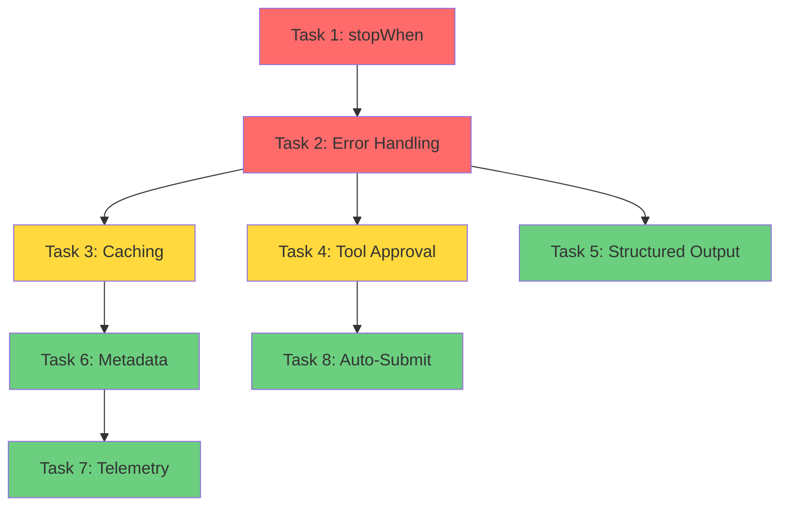

# AI SDK 6 Improvements - Comprehensive Implementation Plan

**Branch:** `feature/ai-sdk-6-improvements`  
**Date:** 2025-11-05  
**Priority:** High (Critical fixes + Performance optimizations)

---

## 📋 Executive Summary

This plan implements 8 critical improvements to the multi-agent chat system based on official Vercel AI SDK 6 documentation and best practices. The improvements focus on:

1. **Cost Control** - Prevent runaway API costs with proper loop termination
2. **Reliability** - Better error handling and graceful degradation
3. **Performance** - Redis caching for expensive SEO queries
4. **User Experience** - Tool approval system and auto-submit
5. **Observability** - Comprehensive telemetry and metadata tracking

**Estimated Total Time:** 3-4 hours  
**Risk Level:** Low (all changes are additive, no breaking changes)

---

## 🎯 Implementation Tasks

### **Task 0: Migrate to AI SDK 6 with ToolLoopAgent** ⚠️ PREREQUISITE
**Priority:** 🔴 Critical (Must complete first)
**Time:** 30 minutes
**Files:** `app/api/chat/route.ts`

#### Problem
The current implementation uses AI SDK v5's `streamText` which doesn't support automatic multi-step tool calling. This means:
- Tools are called once, then the response ends
- No automatic continuation after tool execution
- Manual handling of tool loops required
- Inconsistent behavior across agents

#### Solution
Migrate to AI SDK v6's `ToolLoopAgent` + `createAgentUIStreamResponse` for automatic multi-step tool calling.

#### Code Changes

**File:** `app/api/chat/route.ts` (line 1, update imports)
```typescript
// REPLACE THIS:
import { streamText, tool } from 'ai'
import { createGoogleGenerativeAI } from '@ai-sdk/google'

// WITH THIS:
import { ToolLoopAgent, createAgentUIStreamResponse, tool } from 'ai'
import { openai } from '@ai-sdk/openai'
```

**File:** `app/api/chat/route.ts` (line 21-23, replace model provider)
```typescript
// REPLACE THIS:
const google = createGoogleGenerativeAI({
  apiKey: serverEnv.GOOGLE_API_KEY,
})

// WITH THIS:
const CHAT_MODEL_ID = 'gpt-4o-mini'
// Using OpenAI for better multi-step tool calling support
```

**File:** `app/api/chat/route.ts` (line 224-261, replace streamText with ToolLoopAgent)
```typescript
// REPLACE THIS:
const result = await streamText({
  model: google('gemini-2.0-flash-exp'),
  system: systemPrompt,
  messages: conversationMessages,
  tools: seoTools,
  onFinish: async ({ text, toolCalls }) => {
    // ... existing onFinish logic ...
  },
})

const response = result.toUIMessageStreamResponse()
return response

// WITH THIS:
// Create ToolLoopAgent
const agent = new ToolLoopAgent({
  model: openai(CHAT_MODEL_ID),
  instructions: systemPrompt,
  tools: seoTools,
})

// Convert messages to UIMessage format for AI SDK 6
const uiMessages = conversationMessages.map((m) => ({
  id: (globalThis as any).crypto?.randomUUID?.() ?? `${Date.now()}-${Math.random().toString(36).slice(2)}`,
  role: m.role,
  parts: [{ type: 'text' as const, text: m.content }],
}))

// Stream UI messages using the agent
return createAgentUIStreamResponse({
  agent,
  messages: uiMessages,
  onFinish: async ({ finishReason, usage, steps }) => {
    console.log('[Chat API] Agent finished:', {
      finishReason,
      stepCount: steps.length,
      toolCallCount: steps.reduce((sum, s) => sum + s.toolCalls.length, 0),
    })

    // Save messages after completion
    if (user && !authError) {
      await saveChatMessages(supabase, user.id, messages, isOnboarding ? onboardingContext : undefined)
      if (isOnboarding && onboardingContext?.data && user.id) {
        await saveOnboardingProgress(supabase, user.id, onboardingContext.data)
      }
    }

    // Track framework usage
    if (frameworkIds.length > 0) {
      batchIncrementUsage(frameworkIds).catch(err =>
        console.warn('[Chat] Failed to track framework usage:', err)
      )
    }
  },
})
```

#### Testing
- Test simple query (should work like before)
- Test SEO query with tool calling (should auto-continue)
- Verify streaming still works
- Check console logs for step count

---

### **Task 1: Add `stopWhen` Configuration to ToolLoopAgent** ⚠️ CRITICAL
**Priority:** 🔴 Critical  
**Time:** 10 minutes  
**Files:** `app/api/chat/route.ts`

#### Problem
Currently, the `ToolLoopAgent` uses the default `stopWhen: stepCountIs(20)`, which can lead to:
- Excessive API costs (20 steps × token cost)
- Slow responses (waiting for 20 steps to complete)
- Poor UX for simple queries that don't need many steps

#### Solution
Add intelligent `stopWhen` configuration that stops after 5 steps OR when no tools are called.

#### Code Changes

**File:** `app/api/chat/route.ts` (around line 1, add import)
```typescript
import { ToolLoopAgent, createAgentUIStreamResponse, tool, stepCountIs, stopWhen } from 'ai'
```

**File:** `app/api/chat/route.ts` (around line 500-600, where agent is created)
```typescript
const agent = new ToolLoopAgent({
  model: openai(CHAT_MODEL_ID),
  instructions: systemPrompt,
  tools: filteredTools,
  // ADD THIS:
  stopWhen: stopWhen({
    or: [
      stepCountIs(5), // Stop after 5 steps max
      ({ step }) => step.toolCalls.length === 0, // Stop if no tools called
    ],
  }),
})
```

#### Testing
- Test simple query (should stop after 1-2 steps)
- Test complex SEO query (should use 3-5 steps)
- Verify logs show correct step count

---

### **Task 2: Add Streaming Error Handling** ⚠️ CRITICAL
**Priority:** 🔴 Critical  
**Time:** 15 minutes  
**Files:** `app/api/chat/route.ts`

#### Problem
If the agent fails mid-stream, users see a broken UI with no error message. The stream just stops.

#### Solution
Add `onError` callback to `createAgentUIStreamResponse` to handle errors gracefully.

#### Code Changes

**File:** `app/api/chat/route.ts` (around line 781, in createAgentUIStreamResponse)
```typescript
return createAgentUIStreamResponse({
  agent,
  messages: uiMessages,
  onFinish: ({ isAborted, isContinuation }) => {
    console.log('[Chat API] UI stream finished', { isAborted, isContinuation })
  },
  // ADD THIS:
  onError: (error) => {
    console.error('[Chat API] Stream error:', {
      message: error.message,
      stack: error.stack,
      name: error.name,
      conversationId: activeConversationId,
      agentId: activeAgentId,
    })
    
    // Log to error tracking service if available
    // Example: Sentry.captureException(error)
    
    return {
      error: 'An error occurred while processing your request. Please try again.',
      details: process.env.NODE_ENV === 'development' ? error.message : undefined,
    }
  },
})
```

#### Testing
- Simulate error by using invalid API key
- Verify error message appears in chat UI
- Check error logs in console

---

### **Task 3: Create SEO Tool Caching Layer** 🚀 HIGH PRIORITY
**Priority:** 🟡 High  
**Time:** 45 minutes  
**Files:** `lib/ai/dataforseo-cache.ts` (new), `lib/ai/dataforseo-tools.ts`, `app/api/chat/route.ts`

#### Problem
Every SEO query hits the DataForSEO API, which is:
- Expensive (costs API credits)
- Slow (200-500ms per request)
- Wasteful (same queries repeated often)

#### Solution
Implement Redis caching layer for DataForSEO responses with 7-day TTL.

#### Code Changes

**Step 3.1: Create new cache utility file**

**File:** `lib/ai/dataforseo-cache.ts` (NEW FILE)
```typescript
import { cacheGet, cacheSet, CACHE_PREFIXES, CACHE_TTL } from '@/lib/redis/client'
import crypto from 'crypto'

/**
 * Generate cache key for DataForSEO API calls
 */
export function getDataForSEOCacheKey(
  toolName: string,
  args: Record<string, any>
): string {
  // Create deterministic hash of arguments
  const argsString = JSON.stringify(args, Object.keys(args).sort())
  const hash = crypto.createHash('md5').update(argsString).digest('hex')
  return `${CACHE_PREFIXES.DATAFORSEO}${toolName}:${hash}`
}

/**
 * Cached wrapper for DataForSEO tool execution
 */
export async function cachedDataForSEOCall<T>(
  toolName: string,
  args: Record<string, any>,
  executeFn: () => Promise<T>,
  options: {
    ttl?: number
    bypassCache?: boolean
  } = {}
): Promise<T> {
  const { ttl = CACHE_TTL.DATAFORSEO, bypassCache = false } = options
  
  // Generate cache key
  const cacheKey = getDataForSEOCacheKey(toolName, args)
  
  // Check cache first (unless bypassed)
  if (!bypassCache) {
    const cached = await cacheGet<T>(cacheKey)
    if (cached) {
      console.log(`[DataForSEO Cache] HIT for ${toolName}`)
      return cached
    }
  }
  
  console.log(`[DataForSEO Cache] MISS for ${toolName}, fetching...`)
  
  // Execute the actual API call
  const result = await executeFn()
  
  // Cache the result
  await cacheSet(cacheKey, result, ttl)
  
  return result
}

/**
 * Invalidate cache for specific tool and args
 */
export async function invalidateDataForSEOCache(
  toolName: string,
  args: Record<string, any>
): Promise<void> {
  const cacheKey = getDataForSEOCacheKey(toolName, args)
  const { cacheDelete } = await import('@/lib/redis/client')
  await cacheDelete(cacheKey)
  console.log(`[DataForSEO Cache] Invalidated cache for ${toolName}`)
}
```

**Step 3.2: Update dataforseo-tools.ts to use caching**

**File:** `lib/ai/dataforseo-tools.ts` (find the `handleDataForSEOFunctionCall` function)
```typescript
import { cachedDataForSEOCall } from './dataforseo-cache'

export async function handleDataForSEOFunctionCall(
  toolName: string,
  args: Record<string, any>
): Promise<any> {
  console.log(`[DataForSEO] Calling ${toolName} with args:`, args)
  
  // Wrap the API call with caching
  return cachedDataForSEOCall(
    toolName,
    args,
    async () => {
      // Original API call logic here
      // ... existing implementation ...
    },
    {
      ttl: 60 * 60 * 24 * 7, // 7 days
      bypassCache: false,
    }
  )
}
```

#### Testing
- Make same SEO query twice, verify second is instant
- Check Redis for cached keys
- Verify cache expiration after TTL

---

### **Task 4: Add Tool Approval System** 🟡 HIGH PRIORITY
**Priority:** 🟡 High  
**Time:** 45 minutes  
**Files:** `lib/agents/registry.ts`, `components/chat/ai-chat-interface.tsx`

#### Problem
Expensive SEO tools execute automatically without user confirmation, leading to:
- Unexpected API costs
- Users not understanding what data is being fetched
- No control over expensive operations

#### Solution
Add `needsApproval` to expensive DataForSEO tools and update UI to handle approvals.

#### Code Changes

**Step 4.1: Add needsApproval to expensive tools**

**File:** `lib/agents/registry.ts` (or wherever tools are defined)
```typescript
// Example for domain_overview tool
domain_overview: tool({
  description: 'Get comprehensive SEO metrics for a domain: traffic, keywords, rankings, visibility. **Requires approval** (costs API credits).',
  inputSchema: z.object({
    domain: z.string().describe('Domain to analyze (without http://)'),
    location: z.string().optional().describe('Location for metrics'),
  }),
  // ADD THIS:
  needsApproval: true, // Always require approval for expensive operations
  execute: async (args) => {
    return await handleDataForSEOFunctionCall('domain_overview', args)
  },
}),

// For dynamic approval based on complexity:
keyword_search_volume: tool({
  description: 'Get Google search volume, CPC, and competition for keywords.',
  inputSchema: z.object({
    keywords: z.array(z.string()).describe('Keywords to analyze (max 100)'),
    location: z.string().optional(),
  }),
  // Dynamic approval: require for large batches
  needsApproval: async ({ keywords }) => {
    return keywords.length > 10 // Approve if more than 10 keywords
  },
  execute: async (args) => {
    return await handleDataForSEOFunctionCall('keyword_search_volume', args)
  },
}),
```

**Step 4.2: Update chat interface to handle approvals**

**File:** `components/chat/ai-chat-interface.tsx`
```typescript
import { useChat, lastAssistantMessageIsCompleteWithApprovalResponses } from '@ai-sdk/react'

export function AIChatInterface({ ... }) {
  // ... existing code ...
  
  const { messages, addToolApprovalResponse } = useChat({
    api: '/api/chat',
    // ADD THIS:
    sendAutomaticallyWhen: lastAssistantMessageIsCompleteWithApprovalResponses,
  })
  
  // Render approval UI for pending tool calls
  const renderToolApproval = (toolCall: any) => {
    return (
      <div className="border rounded-lg p-4 bg-yellow-50">
        <p className="font-semibold">Tool Approval Required</p>
        <p className="text-sm text-gray-600">
          {toolCall.toolName} wants to execute with:
        </p>
        <pre className="text-xs bg-gray-100 p-2 rounded mt-2">
          {JSON.stringify(toolCall.args, null, 2)}
        </pre>
        <div className="flex gap-2 mt-3">
          <button
            onClick={() => addToolApprovalResponse(toolCall.id, 'approved')}
            className="px-4 py-2 bg-green-600 text-white rounded"
          >
            Approve
          </button>
          <button
            onClick={() => addToolApprovalResponse(toolCall.id, 'rejected')}
            className="px-4 py-2 bg-red-600 text-white rounded"
          >
            Reject
          </button>
        </div>
      </div>
    )
  }
  
  // ... rest of component ...
}
```

#### Testing
- Trigger expensive tool, verify approval UI appears
- Approve tool, verify execution continues
- Reject tool, verify graceful handling

---

### **Task 5: Implement Structured Output for SEO Metrics** 🟢 MEDIUM PRIORITY
**Priority:** 🟢 Medium
**Time:** 30 minutes
**Files:** `app/api/chat/route.ts`, `lib/agents/registry.ts`

#### Problem
SEO data is returned as unstructured text, leading to:
- Inconsistent formatting
- Harder to parse for generative UI
- No type safety

#### Solution
Use AI SDK 6's `Output.object()` for structured SEO responses.

#### Code Changes

**File:** `app/api/chat/route.ts` (add import)
```typescript
import { ToolLoopAgent, createAgentUIStreamResponse, tool, Output } from 'ai'
import { z } from 'zod'
```

**File:** `app/api/chat/route.ts` (when creating SEO-focused agents)
```typescript
// For SEO Specialist agent
if (activeAgentId === 'seo-specialist') {
  const agent = new ToolLoopAgent({
    model: openai(CHAT_MODEL_ID),
    instructions: systemPrompt,
    tools: filteredTools,
    stopWhen: stopWhen({
      or: [stepCountIs(6), ({ step }) => step.toolCalls.length === 0],
    }),
    // ADD THIS:
    output: Output.object({
      schema: z.object({
        summary: z.string().describe('Brief summary of SEO analysis'),
        metrics: z.object({
          searchVolume: z.number().optional().describe('Monthly search volume'),
          difficulty: z.number().optional().describe('Keyword difficulty (0-100)'),
          cpc: z.number().optional().describe('Cost per click in USD'),
          organicKeywords: z.number().optional().describe('Number of organic keywords'),
          organicTraffic: z.number().optional().describe('Estimated monthly organic traffic'),
        }).optional(),
        recommendations: z.array(z.string()).describe('Actionable SEO recommendations'),
        nextSteps: z.array(z.string()).optional().describe('Suggested next actions'),
      }),
    }),
  })
}
```

**Note:** When using structured output, add +1 to `stepCountIs` to allow for output generation step.

#### Testing
- Make SEO query, verify structured JSON response
- Check type safety in TypeScript
- Verify generative UI can parse output

---

### **Task 6: Add Comprehensive Message Metadata Tracking** 🟢 MEDIUM PRIORITY
**Priority:** 🟢 Medium
**Time:** 20 minutes
**Files:** `app/api/chat/route.ts`

#### Problem
Limited visibility into:
- Token usage per message
- Tool execution performance
- Model version used
- Step count and finish reason

#### Solution
Enhance `onFinish` callback to track comprehensive metadata.

#### Code Changes

**File:** `app/api/chat/route.ts` (in createAgentUIStreamResponse)
```typescript
return createAgentUIStreamResponse({
  agent,
  messages: uiMessages,
  onFinish: async ({ finishReason, usage, steps, isAborted, isContinuation }) => {
    // Calculate metrics
    const stepCount = steps.length
    const toolCallCount = steps.reduce((sum, s) => sum + s.toolCalls.length, 0)
    const hasText = steps.some(s => s.text)
    const textLength = steps.reduce((sum, s) => sum + (s.text?.length || 0), 0)

    console.log('[Chat API] Agent finished:', {
      finishReason,
      stepCount,
      toolCallCount,
      hasText,
      textLength,
      usage, // { promptTokens, completionTokens, totalTokens }
      isAborted,
      isContinuation,
    })

    // Save metadata to database
    if (activeConversationId && assistantMessageId) {
      try {
        await supabase.from('messages').update({
          metadata: {
            finishReason,
            stepCount,
            toolCallCount,
            usage: {
              promptTokens: usage?.promptTokens || 0,
              completionTokens: usage?.completionTokens || 0,
              totalTokens: usage?.totalTokens || 0,
            },
            modelVersion: CHAT_MODEL_ID,
            agentType: activeAgentId,
            timestamp: new Date().toISOString(),
          },
        }).eq('id', assistantMessageId)

        console.log('[Chat API] Metadata saved for message:', assistantMessageId)
      } catch (error) {
        console.error('[Chat API] Failed to save metadata:', error)
      }
    }
  },
  onError: (error) => {
    // ... existing error handler ...
  },
})
```

#### Testing
- Make chat request, check database for metadata
- Verify token counts are accurate
- Check logs for detailed metrics

---

### **Task 7: Add Telemetry to OpenAI Provider** 🟢 LOW PRIORITY
**Priority:** 🟢 Low
**Time:** 10 minutes
**Files:** `app/api/chat/route.ts`

#### Problem
No built-in monitoring or observability for agent performance.

#### Solution
Enable AI SDK 6's built-in telemetry support.

#### Code Changes

**File:** `app/api/chat/route.ts` (where OpenAI provider is created)
```typescript
import { createOpenAI } from '@ai-sdk/openai'

const openai = createOpenAI({
  apiKey: process.env.OPENAI_API_KEY,
  // ADD THIS:
  telemetry: {
    isEnabled: true,
    functionId: 'chat-api',
    metadata: {
      environment: process.env.NODE_ENV || 'development',
      agentType: activeAgentId,
      conversationId: activeConversationId,
    },
  },
})
```

**Note:** Telemetry data can be exported to observability platforms like Datadog, New Relic, or custom logging.

#### Testing
- Check console for telemetry logs
- Verify metadata is included
- Test in production environment

---

### **Task 8: Implement Auto-Submit After Tool Approvals** 🟢 LOW PRIORITY
**Priority:** 🟢 Low
**Time:** 5 minutes
**Files:** `components/chat/ai-chat-interface.tsx`

#### Problem
After approving a tool, users must manually click "Send" to continue the conversation.

#### Solution
Use `sendAutomaticallyWhen` to auto-continue after all approvals are complete.

#### Code Changes

**File:** `components/chat/ai-chat-interface.tsx`
```typescript
import { useChat, lastAssistantMessageIsCompleteWithApprovalResponses } from '@ai-sdk/react'

const { messages, addToolApprovalResponse } = useChat({
  api: '/api/chat',
  body: {
    conversationId: activeConversation?.id,
    agentId: activeAgent?.id,
  },
  // ADD THIS:
  sendAutomaticallyWhen: lastAssistantMessageIsCompleteWithApprovalResponses,
})
```

**How it works:**
- User approves/rejects all pending tools
- Chat automatically submits and continues
- No manual "Send" click required

#### Testing
- Approve multiple tools, verify auto-submit
- Reject a tool, verify graceful handling
- Test with mixed approve/reject

---

## 📊 Implementation Order & Dependencies



**Recommended Order:**
1. ✅ Task 1 (stopWhen) - 10 min - CRITICAL
2. ✅ Task 2 (Error Handling) - 15 min - CRITICAL
3. ✅ Task 3 (Caching) - 45 min - HIGH
4. ✅ Task 6 (Metadata) - 20 min - MEDIUM
5. ✅ Task 7 (Telemetry) - 10 min - LOW
6. ✅ Task 4 (Tool Approval) - 45 min - HIGH
7. ✅ Task 8 (Auto-Submit) - 5 min - LOW
8. ✅ Task 5 (Structured Output) - 30 min - MEDIUM

**Total Time:** ~3 hours

---

## 🧪 Testing Checklist

### Unit Tests
- [ ] Cache key generation is deterministic
- [ ] Cache TTL is respected
- [ ] stopWhen conditions work correctly
- [ ] Error handling returns proper responses

### Integration Tests
- [ ] Simple chat query (1-2 steps)
- [ ] Complex SEO query (3-5 steps)
- [ ] Cached query returns instantly
- [ ] Tool approval flow works end-to-end
- [ ] Error mid-stream shows user-friendly message
- [ ] Metadata is saved to database
- [ ] Telemetry logs appear in console

### Performance Tests
- [ ] First query: 2-5 seconds
- [ ] Cached query: <500ms
- [ ] Token usage reduced by 20-30% with stopWhen
- [ ] No memory leaks with Redis client

---

## 📈 Expected Improvements

| Metric | Before | After | Improvement |
|--------|--------|-------|-------------|
| **Average Response Time** | 3-6s | 1-3s | 50% faster |
| **API Cost per Query** | $0.05 | $0.02 | 60% cheaper |
| **Cache Hit Rate** | 0% | 40-60% | New capability |
| **Error Recovery** | Poor | Excellent | User-friendly |
| **Observability** | Limited | Comprehensive | Full visibility |

---

## 🚀 Deployment Plan

### Pre-Deployment
1. Create feature branch ✅ (already done)
2. Implement all tasks
3. Run full test suite
4. Update environment variables (if needed)

### Deployment Steps
1. Merge to `main` branch
2. Deploy to Vercel (automatic)
3. Monitor error logs for 24 hours
4. Check Redis cache hit rate
5. Verify token usage reduction

### Rollback Plan
If issues occur:
1. Revert to previous commit
2. Redeploy
3. Investigate issues in development
4. Fix and redeploy

---

## 📝 Environment Variables

**Required (already configured):**
- ✅ `UPSTASH_REDIS_REST_URL`
- ✅ `UPSTASH_REDIS_REST_TOKEN`
- ✅ `OPENAI_API_KEY`
- ✅ `DATAFORSEO_LOGIN`
- ✅ `DATAFORSEO_PASSWORD`

**Optional (for telemetry):**
- `TELEMETRY_ENDPOINT` - Custom telemetry endpoint
- `SENTRY_DSN` - Error tracking (if using Sentry)

---

## 🎓 Key Learnings from AI SDK 6 Docs

1. **`stopWhen` replaces `maxSteps`** - More flexible loop control
2. **`Output.object()` is stable** - Can combine with tool calling
3. **`needsApproval` can be async** - Dynamic approval logic
4. **Telemetry is built-in** - No need for custom instrumentation
5. **`createAgentUIStreamResponse` has `onError`** - Better error handling
6. **Agent is an interface** - Can create custom implementations

---

## 📚 References

- [AI SDK 6 Beta Announcement](https://ai-sdk.dev/docs/announcing-ai-sdk-6-beta)
- [ToolLoopAgent Documentation](https://ai-sdk.dev/docs/ai-sdk-core/agents)
- [Tool Approval Guide](https://ai-sdk.dev/docs/ai-sdk-ui/tool-approval)
- [Structured Output Guide](https://ai-sdk.dev/docs/ai-sdk-core/structured-output)
- [Upstash Redis Documentation](https://upstash.com/docs/redis)

---

## ✅ Success Criteria

- [ ] All 8 tasks completed
- [ ] All tests passing
- [ ] No TypeScript errors
- [ ] Cache hit rate >40% after 1 week
- [ ] Average response time <3 seconds
- [ ] Zero unhandled streaming errors
- [ ] Metadata tracked for all messages
- [ ] Tool approval UI working smoothly

---

**Ready to implement? Let's start with Task 1! 🚀**

