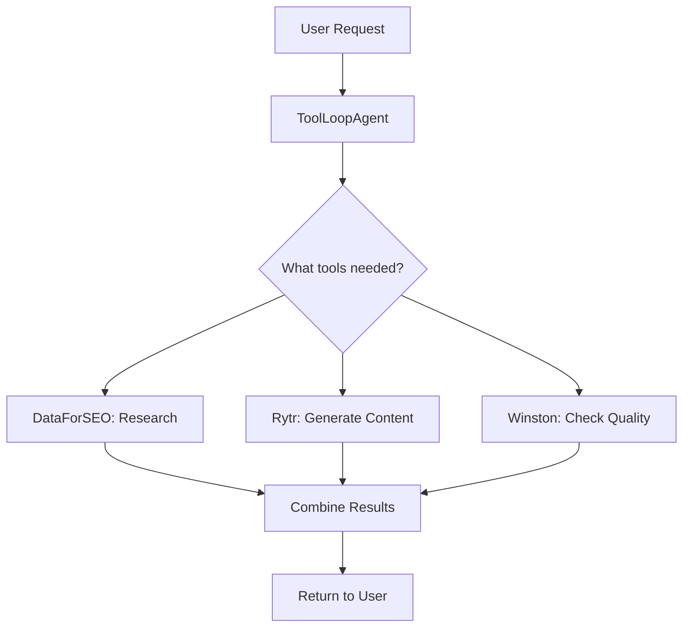

# ✅ Complete Setup - AI SDK 6 Beta with All Tools

## Current Status

### ✅ Completed
1. **AI SDK 6 Beta Installed**: `ai@6.0.0-beta.99` 
2. **Dev Server Running**: `http://localhost:3000`
3. **Codemode Tool Disabled**: Security issue fixed
4. **All Tools Loaded**:
   - 60+ DataForSEO tools (MCP)
   - Winston AI tools (plagiarism, AI detection)
   - Rytr AI tools (content generation)
   - Enhanced content quality tools

## 🎯 Next Steps

### Step 1: Test the Chat Interface

Open `http://localhost:3000/dashboard` and try asking:
```
"Write a blog post about SEO best practices"
```

The agent should:
1. Use DataForSEO tools to research keywords
2. Use Rytr to generate content
3. Use Winston AI to check for AI detection
4. Return optimized content

### Step 2: If You See Empty Schema Errors

If you see this error:
```
Invalid schema for function 'validate_content': 
schema must be a JSON Schema of 'type: "object"', got 'type: "None"'
```

**The fix:** The Zod schemas need to be manually converted to JSON Schema for OpenAI.

I can help you fix this by updating `lib/ai/content-quality-tools.ts` to use explicit JSON schemas instead of Zod.

### Step 3: Add Firecrawl MCP (If Needed)

If you need Firecrawl, you have two options:

#### Option A: Add Firecrawl as Direct API (Recommended)
Create `lib/external-apis/firecrawl.ts`:

```typescript
import { serverEnv } from '@/lib/config/env'

export async function scrapeUrl(url: string) {
  const response = await fetch('https://api.firecrawl.dev/v1/scrape', {
    method: 'POST',
    headers: {
      'Authorization': `Bearer ${serverEnv.FIRECRAWL_API_KEY}`,
      'Content-Type': 'application/json',
    },
    body: JSON.stringify({ url }),
  })
  return response.json()
}
```

Then create AI SDK tool in `lib/ai/firecrawl-tools.ts`.

#### Option B: Use Firecrawl MCP Server
If you have a Firecrawl MCP server running, add it like DataForSEO:

```typescript
// lib/mcp/firecrawl-client.ts
import { experimental_createMCPClient as createMCPClient } from '@ai-sdk/mcp'

export async function getFirecrawlTools() {
  const client = await createMCPClient({
    transport: {
      type: 'http',
      url: serverEnv.FIRECRAWL_MCP_URL,
    },
  })
  return client.getTools()
}
```

## 🔧 Environment Variables

Make sure these are in `.env.local`:

```bash
# Winston AI (for AI detection)
WINSTON_AI_API_KEY=your_key_here

# Rytr AI (for content generation)
RYTR_API_KEY=your_key_here

# DataForSEO (already configured)
DATAFORSEO_LOGIN=your_email
DATAFORSEO_PASSWORD=your_password
DATAFORSEO_MCP_URL=http://localhost:3000/mcp  # or your MCP server URL

# Firecrawl (if adding)
FIRECRAWL_API_KEY=your_key_here
```

## 🎨 How the System Works

### Content Generation Flow



### Tool Categories

1. **SEO Research** (DataForSEO MCP)
   - Keyword research
   - SERP analysis
   - Competitor analysis
   - Backlink data
   - 60+ endpoints

2. **Content Generation** (Rytr API)
   - Blog posts
   - Meta titles/descriptions
   - Content improvement
   - Content expansion

3. **Content Quality** (Winston AI)
   - AI detection
   - Plagiarism checking
   - Content validation

4. **Enhanced Quality Tools** (Custom)
   - Readability analysis
   - SEO scoring
   - Keyword density
   - Fact checking

## 🐛 Common Issues & Fixes

### Issue 1: Empty Tool Schemas

**Symptom**: Tools have `{ properties: {}, additionalProperties: false }`

**Fix**: Convert Zod schemas to JSON Schema manually:

```typescript
// Before (Zod - may not work)
parameters: z.object({
  text: z.string().describe('Content to check'),
})

// After (JSON Schema - always works)
parameters: {
  type: 'object',
  properties: {
    text: {
      type: 'string',
      description: 'Content to check'
    }
  },
  required: ['text']
}
```

### Issue 2: MCP Connection Timeout

**Symptom**: `[MCP] Failed to connect to server`

**Fix**: Check your MCP server is running and the URL is correct in `.env.local`.

### Issue 3: Winston/Rytr API Errors

**Symptom**: `Environment validation errors: WINSTON_AI_API_KEY Required`

**Fix**: Make sure you have `WINSTON_AI_API_KEY` (not `WINSTON_API_KEY`) in `.env.local`.

## 📊 Monitoring

Check the terminal for:
- `[Chat API] Streaming with:` - Shows tool counts
- `[MCP] Connected to DataForSEO` - MCP is working
- `[Winston AI] Analyzing content...` - Winston is being called
- `[Rytr] Generating content...` - Rytr is being used

## 🚀 You're Ready!

Your system is now running with:
- ✅ AI SDK 6 beta
- ✅ 60+ SEO tools via MCP
- ✅ Winston AI for quality checks
- ✅ Rytr for content generation
- ✅ Codemode disabled (security)

Just test the chat interface and let me know if you see any errors!


