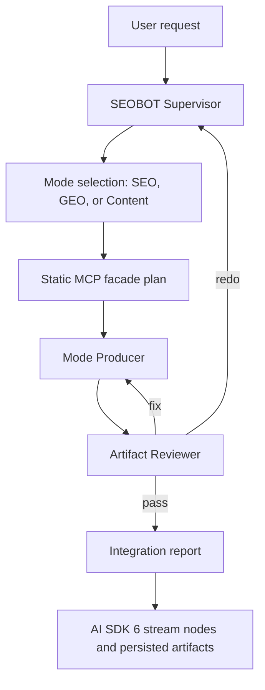

# SEOBOT Multi-Agent Harness Team Spec

## Purpose

This harness coordinates AI-driven SEO, GEO, and generative content intelligence work in SEOBOT without letting the model context collapse under the weight of 100+ MCP endpoints. It uses a Supervisor pattern as the outer architecture and a Producer-Reviewer loop as the quality gate for every user-facing artifact.

The harness is designed for the existing Next.js app in this repository, especially:

- `app/api/chat/route.ts`
- `lib/chat/*`
- `lib/agents/*`
- `lib/mcp/*`
- `components/chat/generative-ui/*`
- `components/chat/artifacts/*`
- `lib/artifacts/artifact-store.ts`

## Architecture

Outer pattern: `Supervisor`

Inner quality pattern: `Producer-Reviewer`

The supervisor owns routing, mode selection, work assignment, and integration. Producers create the user-facing intelligence artifact. Reviewers enforce evidence, mode, endpoint, and AI SDK 6 UI contracts before the artifact is integrated.

## Roles

| Role | Skill | Owns | Primary Output |
| --- | --- | --- | --- |
| Supervisor | `.agents/skills/seobot-supervisor/SKILL.md` | Mode routing, task brief, delegation, revision loop, final integration | `_workspace/01_supervisor_task-brief.md`, `_workspace/04_supervisor_integration-report.md` |
| MCP Static Wrapper Architect | `.agents/skills/seobot-mcp-static-wrapper/SKILL.md` | Compact facade tool design for 100+ endpoints | `_workspace/02_mcp_facade-plan.md` |
| Mode Producer | `.agents/skills/seobot-mode-producer/SKILL.md` | SEO/GEO/Content artifact generation | `_workspace/03_producer_artifact.md` |
| Artifact Reviewer | `.agents/skills/seobot-artifact-reviewer/SKILL.md` | Quality gate and UI contract review | `_workspace/03_reviewer_findings.md` |

## Runtime Modes

### SEO Mode

SEO Mode handles search-engine visibility and ranking work.

Use for:

- keyword research and clustering
- SERP inspection and ranking opportunity
- technical and on-page audits
- schema opportunities
- backlink and competitor overlap
- local/search vertical opportunities

Preferred UI nodes:

- `KeywordMetrics`
- `SerpResults`
- `DomainAnalytics`
- `ContentGapMatrix`
- `text`
- `attachment` for CSV keyword exports or markdown audit summaries

Primary facade families:

- keyword universe
- SERP inspection
- domain/rank analytics
- on-page crawl summary
- competitor overlap
- backlink prospect summary

### GEO Mode

GEO Mode handles generative engine optimization and AI answer visibility.

Use for:

- AI answer inclusion and omission analysis
- entity clarity and brand positioning
- citation opportunity discovery
- platform-by-platform visibility comparison
- prompt-set evaluation across answer engines
- answer-market gap analysis

Preferred UI nodes:

- `AIPlatformMetrics`
- `AISearchMetrics`
- `CitationRecommendations`
- `DomainAnalytics`
- `text`
- `attachment` for JSON evidence bundles or markdown answer-market reports

Primary facade families:

- AI visibility snapshot
- citation candidate fetch
- answer gap analysis
- platform mention comparison
- entity clarity audit
- prompt-set evaluation

### Content Mode

Content Mode handles generative content intelligence and editorial production.

Use for:

- content briefs and outlines
- content gap matrices
- topical authority maps
- refresh and rewrite plans
- E-E-A-T analysis
- draft, optimize, and validate workflows

Preferred UI nodes:

- `ContentStrategy`
- `ContentGapMatrix`
- `CitationRecommendations`
- `KeywordMetrics`
- `text`
- `attachment` for briefs, outlines, drafts, or source packs

Primary facade families:

- content gap matrix
- outline brief
- topical authority map
- content quality audit
- freshness refresh plan
- source pack

## Static Wrapper Pattern

The core containment rule: the model-facing layer must never receive raw schemas or descriptions for every MCP endpoint. SEOBOT should expose compact semantic facades while endpoint detail stays in typed code.

### Layer 1: Static Endpoint Catalog

Store endpoint metadata in code or generated static manifests. The catalog may include:

- `provider`
- `endpointId`
- `capabilityTags`
- `runtimeModes`
- `requiredInputs`
- `normalizedOutputKind`
- `costHint`
- `rateLimitHint`
- `freshnessPolicy`
- `executorPath`

The catalog is for deterministic selection and validation. It is not prompt material.

### Layer 2: Mode Facade Tools

Expose a small semantic tool set to models. A single run should normally expose fewer than twelve facade tools.

Example facade names:

- `researchKeywordUniverse`
- `inspectSerp`
- `estimateRankOpportunity`
- `summarizeOnPageIssues`
- `measureAiVisibility`
- `compareAiPlatformMentions`
- `findCitationOpportunities`
- `buildContentGapMatrix`
- `draftContentBrief`
- `auditContentQuality`

### Layer 3: Endpoint Executors

Executors live behind `lib/mcp/{provider}/` wrappers and handle:

- auth
- caching
- retries
- Zod validation
- usage logging
- cost/rate governance
- response normalization
- provenance and raw result references

Generated `mcps/` bindings must not be imported directly by agents or chat orchestration.

## Artifact Contracts

Every artifact must declare its AI SDK 6 stream UI mapping before integration.

| Contract Field | Required | Notes |
| --- | --- | --- |
| `artifactId` | Yes | Stable id for persistence and review |
| `mode` | Yes | One of `seo`, `geo`, `content` |
| `intent` | Yes | Short semantic intent, such as `keyword-gap` or `ai-visibility-snapshot` |
| `streamNodes` | Yes | Ordered list of AI SDK 6 UI node mappings |
| `componentPayloads` | When `data` nodes exist | Payload must match existing generative UI component props |
| `attachments` | When files are produced | Include name, content type, size, and URL or storage id |
| `evidence` | When live data is used | Include provider, source, freshness, confidence |
| `persistenceTarget` | Yes | Chat message, library item, artifact store, or report path |

### Standard Stream Node Mapping

| Node | Use | SEOBOT Mapping |
| --- | --- | --- |
| `text` | Narrative response, explanation, recommendations | Standard chat response renderer |
| `tool-invocation` | Facade call progress and results | AI SDK 6 tool invocation parts saved through `saveUIMessage` |
| `data` | Structured component payload | `components/chat/generative-ui/*` |
| `attachment` | Downloadable or persisted file | Chat attachments or library save flow |
| `artifact` | Durable generated item | `components/chat/artifacts/*` and `lib/artifacts/artifact-store.ts` |

### Component Payload Targets

Use existing components before inventing new ones:

- `KeywordMetrics`
- `SerpResults`
- `DomainAnalytics`
- `AIPlatformMetrics`
- `AISearchMetrics`
- `ContentStrategy`
- `CitationRecommendations`
- `DomainKeywordProfile`
- `ContentGapMatrix`

If a new component is necessary, the producer must include a prop contract and the reviewer must verify that it can be rendered without overlapping existing chat or artifact patterns.

## Handoff Files

All intermediate files live under `_workspace/` and are preserved for auditability.

| File | Owner | Purpose |
| --- | --- | --- |
| `_workspace/01_supervisor_task-brief.md` | Supervisor | Original request, chosen mode, acceptance criteria, artifact contract |
| `_workspace/02_mcp_facade-plan.md` | MCP Static Wrapper Architect | Facade tools, provider routing, excluded endpoint categories |
| `_workspace/03_producer_artifact.md` | Mode Producer | Generated artifact, payload examples, evidence |
| `_workspace/03_reviewer_findings.md` | Artifact Reviewer | `pass`, `fix`, or `redo` review |
| `_workspace/04_supervisor_integration-report.md` | Supervisor | Final integration summary and residual risk |

## Normal Workflow

1. Supervisor reads the request and selects exactly one primary mode.
2. Supervisor writes the task brief and artifact contract.
3. Static wrapper architect creates a facade plan if MCP or external data is involved.
4. Producer generates the artifact using only selected facades and existing repo services.
5. Reviewer checks mode fit, evidence quality, MCP containment, and UI stream contract.
6. Producer revises only when reviewer status is `fix`.
7. Supervisor integrates after reviewer status is `pass`.

## Failure Policy

| Failure | Owner | Response |
| --- | --- | --- |
| Mode ambiguity | Supervisor | Choose the safest default from context; ask the user only if wrong mode would change business meaning |
| Endpoint overload | MCP Static Wrapper Architect | Collapse endpoints into semantic facades and exclude nonessential provider families |
| Missing source freshness | Producer | Mark as inference or rerun through a facade with source/freshness support |
| Invalid UI payload | Reviewer | Return `fix` with field-level correction notes |
| Wrong mode or unsupported artifact | Reviewer | Return `redo` |
| Two failed fix loops | Supervisor | Stop and write integration report with blocker and exact missing input |

## Acceptance Criteria

- A request is routed to `SEO Mode`, `GEO Mode`, or `Content Mode`.
- No active prompt contains raw documentation for 100+ MCP endpoints.
- MCP work goes through static catalogs, semantic facades, and existing `lib/mcp/*` wrappers.
- Every artifact declares AI SDK 6 stream nodes and maps data payloads to standard SEOBOT components or attachments.
- Reviewer findings are durable and use `pass`, `fix`, or `redo`.
- Final integration report lists files changed, verification performed, and known limitations.

## Scenario Tests

### SEO Mode Scenario

Request: "Find keyword opportunities for an AI scheduling tool."

Expected:

- Supervisor selects `SEO Mode`.
- Static wrapper plan exposes keyword universe, SERP inspection, and competitor overlap facades only.
- Producer maps structured data to `KeywordMetrics`, `SerpResults`, and optional CSV attachment.
- Reviewer checks source freshness and payload compatibility.

### GEO Mode Scenario

Request: "Why are competitors cited by AI answers but not us?"

Expected:

- Supervisor selects `GEO Mode`.
- Static wrapper plan exposes AI visibility, citation opportunity, and platform mention comparison facades.
- Producer maps output to `AIPlatformMetrics`, `AISearchMetrics`, and `CitationRecommendations`.
- Reviewer blocks any unsupported platform claims.

### Content Mode Scenario

Request: "Build a content brief and gap matrix for best AI email tools."

Expected:

- Supervisor selects `Content Mode`.
- Static wrapper plan exposes source pack, content gap matrix, and outline brief facades.
- Producer maps output to `ContentStrategy`, `ContentGapMatrix`, `CitationRecommendations`, and markdown attachment.
- Reviewer checks E-E-A-T, source coverage, and payload shape.

## Maintenance Notes

- Add new providers to the static catalog before exposing new facade tools.
- Add new facade tools only when an existing facade cannot express the user intent cleanly.
- Keep mode routing in sync with `lib/chat/modes`, `lib/chat/intent-classifier`, and `lib/chat/tool-assembler`.
- Keep UI contracts in sync with `components/chat/generative-ui/index.tsx` and artifact persistence in `components/chat/artifacts/*`.
- Delete or simplify recovery rules when implementation becomes deterministic enough that they no longer affect decisions.
